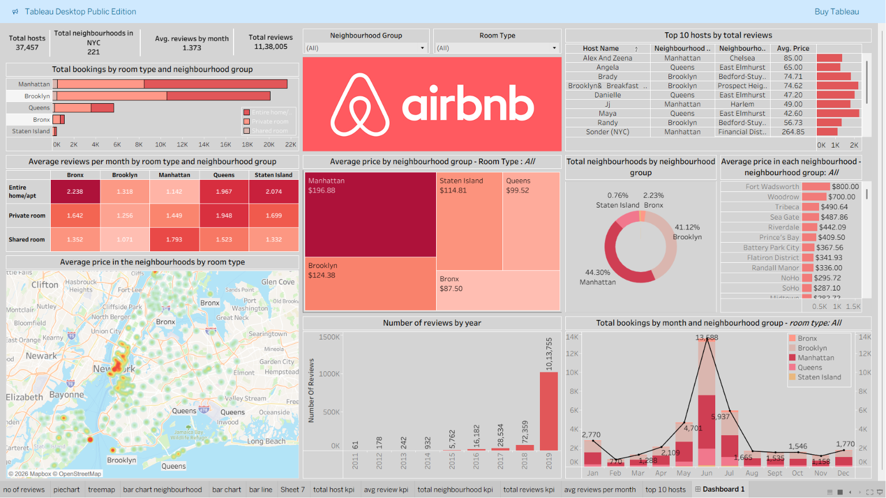

[README (1).md](https://github.com/user-attachments/files/29744643/README.1.md)# 🏙️ NYC Airbnb Data Analysis — Tableau Dashboard

An exploratory data analysis and interactive dashboard built in Tableau, uncovering pricing, availability, and host patterns across ~48,895 Airbnb listings in New York City.

🔗 **[View Interactive Dashboard on Tableau Public](https://public.tableau.com/views/NewYorkCityAirbnb_17768523314010/Dashboard1?:language=en-US&publish=yes&:sid=&:redirect=auth&:display_count=n&:origin=viz_share_link)**

## Overview

New York City hosts thousands of Airbnb listings across its five boroughs, making it a rich but complex dataset to analyze. This project explores pricing patterns, neighborhood preferences, availability trends, and host behavior through an interactive Tableau dashboard.

## Objectives

- Identify the distribution of listings across different neighborhoods and boroughs
- Analyze pricing trends based on room type, location, and availability
- Understand host activity and the concentration of listings per host
- Detect patterns in customer reviews and their correlation with pricing
- Provide actionable insights through an interactive dashboard

## Dataset

- **Source:** [Inside Airbnb](http://insideairbnb.com/) / Kaggle public dataset
- **Records:** ~48,895 Airbnb listings in New York City
- **Key attributes:** Listing ID, Name, Host ID, Neighbourhood Group, Neighbourhood, Room Type, Price, Minimum Nights, Number of Reviews, Availability, Last Review Date
- **Raw data:** included in this repo as `AB_NYC_2019.csv`

## Tools & Technologies

| Tool | Purpose |
|------|---------|
| Tableau Desktop / Public | Data visualization and dashboard creation |
| Microsoft Excel / CSV | Preliminary data review and cleaning |
| Kaggle / Inside Airbnb | Source platform for dataset |

## Key Insights

- **Manhattan and Brooklyn** account for the majority of listings, reflecting their popularity among tourists and short-term visitors
- **Entire home/apartment** listings command significantly higher prices than private or shared rooms
- Listings with **higher review counts tend toward moderate pricing**, suggesting a sweet spot between affordability and quality
- **Availability varies greatly by neighborhood** — some hosts maintain year-round listings while others operate seasonally
- A **small number of hosts manage a disproportionately large share of listings**, indicating the presence of professional hosting businesses operating at scale

## Dashboard Features

The interactive dashboard lets users filter by borough, room type, price range, and availability, and includes:
- Total bookings by room type and neighborhood group
- Average price by neighborhood group and room type
- Top 10 hosts by total reviews
- Reviews-per-month trends and yearly review volume
- Geographic map of pricing by neighborhood

## Possible Extensions

- Sentiment analysis on guest reviews
- Time-series forecasting of pricing trends
- Geo-spatial clustering to identify high-demand micro-areas

## Author

Ashiq Hameed — B.Tech Artificial Intelligence & Data Science

